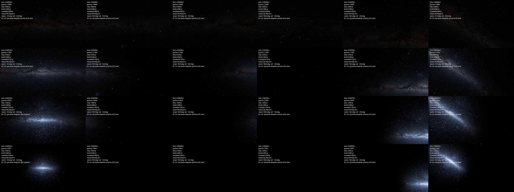

# Stapledon's Voyage: Godot + AILANG spike

A proof of the architecture for rebuilding
[Stapledon's Voyage](https://github.com/sunholo-data/stapledons_voyage) from its
design docs:

- **AILANG owns the simulation.** `sim/ship.ail` runs as a child process
  (`ailang run --bytecode`) and keeps the world state.
- **Godot owns everything visible.** The two talk newline-delimited JSON over
  stdin/stdout, one request and one reply per tick.
- **Relativity is rendered accurately and tested.** Aberration, Doppler colour
  and beaming are checked against closed-form values on the CPU, and the GPU
  shader is checked against the CPU reference to sub-pixel accuracy.



Rows show 0, 0.5, 0.9 and 0.99c while accelerating at 1 g. Columns show the
view forward, to starboard and astern. The 3,802 CNS5 stars within about 40
light-years crowd forward and turn blue-white. Astern they are redshifted below
the visible band and disappear.

## Run it

Requires Godot 4.7+ and the pinned AILANG v0.52.0 on `PATH`, or use `AILANG=runtime/bin/ailang`.

```sh
make test      # physics reference, sim vs closed form, VM/interpreter parity, strict-VM core (headless)
make golden    # GPU shader vs CPU reference star positions (opens a window)
make capture   # 1 g voyage driven by the AILANG sim, PNGs to renders/
make run       # current expanded ship: WASD walk, Option-drag look, E lift, M navigation, hold I identify
```

Normal launch opens one current ship at the captain’s measured eye, initially at rest in a live navigation session. Scroll out for a labelled third-person view. Select a star in navigation and hold Commit to watch actual acceleration, cruise and braking aboard ship. Hold I and click a known visible star to read catalogue facts; Open in map selects that exact source.

The original fixed-view painted bridge remains an explicit `--interior` art/capture reference. `make voyage` runs the dedicated sky controls.

## Layout

| Path | What |
|---|---|
| `sim/core.ail` | Pure simulation core. Runs entirely on the bytecode VM (`make strict`). Physics from [`sunholo/relativity`](https://github.com/sunholo-data/ailang-packages/tree/main/packages/relativity) |
| `sim/ship.ail` | I/O shell: the NDJSON loop around the core (I/O is bridged to the interpreter until AILANG Phase 2E) |
| `bridge/sim_bridge.gd` | Spawns the sim and exchanges one JSON line per tick |
| `physics/relativity.gd` | Reference SR maths (float64): aberration, Doppler, point-source beaming |
| `physics/blackbody.gd` | Planck spectrum × CIE 1931 → linear sRGB; temperature LUT for the shader |
| `sky/starfield.gdshader` | GPU mirror of the reference: per-star aberration, D·T colour, (Y(DT)/Y(T))/D² flux |
| `tests/` | `test_physics.gd` (27 checks), `test_sim_bridge.gd` (bridge + sim integration) |
| `main.gd` | Scene, HUD, interactive loop, `--capture` and `--golden` modes |

## Physics notes

- **Aberration.** A source at galaxy-frame angle θ from the direction of motion
  appears at cos θ' = (cos θ + β)/(1 + β cos θ). At 0.9c a star at 90° appears
  25.84° off the bow.
- **Doppler.** D = γ(1 + β cos θ). A blackbody at T is seen as a blackbody at
  D·T.
- **Point-source brightness.** I_ν/ν³ is invariant and the solid angle scales by
  1/D², so the visual-band flux scales by (Y(D·T)/Y(T))/D². Bolometrically that
  is D².
- **Precision near c.** γ and 1 − β come from the float64 sim, and the shader
  rewrites 1 + β cos θ to avoid cancellation.
- **Known simplifications (spike).**
  - Star temperatures come from the spectral-class letter only.
  - There is no Milky Way background yet.
  - The ship moves on a single axis toward the galactic centre.

Findings and the roadmap live in the design repo.

## License

The [Apache License 2.0](LICENSE) (Copyright 2026 Sunholo / Mark Edmondson) covers the **code**.
The **AI-generated art** (the captain, the bridge, the concept art) carries **no copyright claim**
(D-33). **Third-party assets** keep their own licences and are listed on the
[credits page](https://www.sunholo.com/stapledons-godot/docs/credits): among them the Milky Way
panorama (NOIRLab `noirlab2430b`, E. Slawik / NOIRLab / NSF / AURA, CC BY 4.0), the planet
textures ([Solar System Scope](https://www.solarsystemscope.com/textures/), CC BY 4.0) and the star
catalogues (CNS5, Gaia GCNS, Hipparcos) under their providers' terms.
